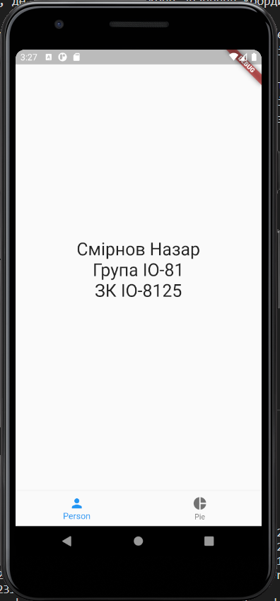
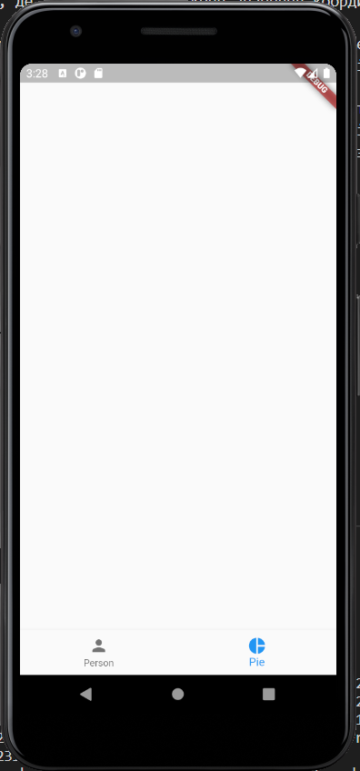
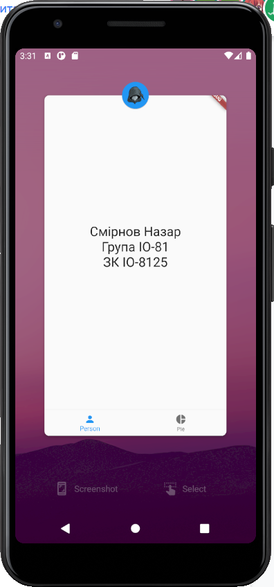
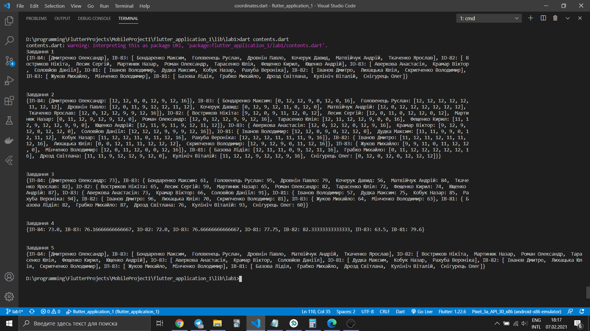
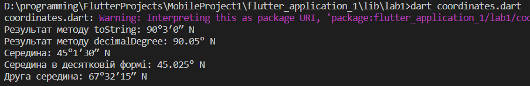

# Lab 1.2

Виконав:
Студент групи: ІО-81
ЗК: ІО-8125
Смірнов Назар

## Варіант №2

1. Завантажте архів за посиланням та виконайте описані задачі.
2. Використайте файл playground з частини 1. Створіть клас, визначений за варіантом, де варіант = (номер залікової книжки mod 2) + 1.
3. Створіть клас CoordinateXY, який представляє координату (не локацію, оскільки локація складається із двох координат), де X перша літера вашого імені, Y перша літера вашого прізвища.
4. Створіть перерахування Direction, що представляє напрямок/позицію (широта, довгота).
5. Додайте властивість типу Direction у клас CoordinateXY.
6. Додайте властивість типу Int та дві властивості типу UInt в клас CoordinateXY для представлення градусів, мінут та секунд відповідно.
7. Додайте методи ініціалізації:
   a) з нульовими значеннями за замовчанням;
   б) з заданим набором значень (градуси, мінути, секунди) (перевірте вхідні значення – градуси ∈ [-90, 90] для широти / [-180, 180] для довготи, мінути ∈ [0, 59], секунди ∈ [0, 59]).
8. Додайте методи, що повертають:
   а) значення типу String у форматі “xx°yy′zz″ Z”, де xx – градуси, yy – мінути, zz – секунди, Z – N/S/W/E (залежить від Direction);
   б) значення типу String у форматі “xx,xxx...° Z”, де xx,xxx... – десяткове значення координати, Z – N/S/W/E (залежить від Direction);
9. об'єкт типу CoordinateXY, що представляє середню координату між координатами, що представлені поточним об'єктом та об'єктом, що отриманий як вхідний параметр, або nil, якщо об'єкти мають різний напрямок/позицію (Direction).
10. Додайте методи класу, що повертають:
    а) об'єкт типу CoordinateXY, що представляє середню координату між координатами, що представлені двома об'єктами, що отримані як вхідні параметри, або nil, якщо об'єкти мають різний напрямок/позицію (Direction).
11. Створіть декілька об'єктів типу CoordinateXY за допомогою різних ініціалізаторів (методи з кроку 15).
12. Продемонструйте використання методів з кроків 16 та 17 (виведіть результати).
13. Закомітьте та відправте ваш проект до будь-якої системи контролю версій
14. Підготуйте протокол за шаблоном.
15. Надішліть виконане завдання через Google Classroom - додайте посилання до вашого проекту та протокол.

## Скріншот роботи додатка

Перша сторінка:
<br/>


Друга Сторінка:
<br/>


Іконка:
<br/>


Виконання contents.dart:
<br/>


Виконання coordinates.dart:
<br/>


## Лістинг коду

```dart {.line-numbers}
// lib/main.dart

import 'package:flutter/material.dart';

import 'home_widget.dart';

void main() {
  runApp(MyApp());
}

class MyApp extends StatelessWidget {
  @override
  Widget build(BuildContext context) {
    return MaterialApp(
      home: HomePage(),
    );
  }
}
```

```dart {.line-numbers}
// lib/home_widget.dart

import 'package:flutter/material.dart';
import 'package:flutter_application_1/person_widget.dart';

class HomePage extends StatefulWidget {
  @override
  State<StatefulWidget> createState() {
    return _HomePageState();
  }
}

class _HomePageState extends State<HomePage> {
  int _currentIndex = 0;

  final List<Widget> _children = [
    Person(),
    Scaffold(), // заглушка
  ];

  @override
  Widget build(BuildContext context) {
    return Scaffold(
      body: _children[_currentIndex],
      bottomNavigationBar: BottomNavigationBar(
        onTap: onTabTapped,
        currentIndex: _currentIndex,
        items: const <BottomNavigationBarItem>[
          BottomNavigationBarItem(
            icon: Icon(Icons.person),
            label: "Person",
          ),
          BottomNavigationBarItem(
            icon: Icon(Icons.pie_chart),
            label: "Pie",
          ),
        ],
      ),
    );
  }

  void onTabTapped(int index) {
    setState(() {
      _currentIndex = index;
    });
  }
}
```

```dart {.line-numbers}
// lib/person_widget.dart

import 'package:flutter/material.dart';

class Person extends StatelessWidget {
  @override
  Widget build(BuildContext context) {
    return Scaffold(
      body: Center(
        child: Column(
          mainAxisAlignment: MainAxisAlignment.center,
          children: <Widget>[
            Text(
              'Смірнов Назар'
              '\nГрупа ІО-81'
              '\nЗК ІО-8125',
              textAlign: TextAlign.center,
              style: TextStyle(fontSize: 28),
            ),
          ],
        ),
      ),
    );
  }
}
```

```dart {.line-numbers}
// lib/lab1/contents.dart

import 'dart:math';

var randomer = Random();

int randomValue(int maxValue) {
  switch (randomer.nextInt(6)) {
    case 1:
      return (maxValue * 0.7).ceil();
    case 2:
      return (maxValue * 0.9).ceil();
    case 3:
    case 4:
    case 5:
      return maxValue;
    default:
      return 0;
  }
}

void main(List<String> args) {
  // Частина 1

  // Дано рядок у форматі "Student1 - Group1; Student2 - Group2; ..."

  String studentsStr =
      "Дмитренко Олександр - ІП-84; Матвійчук Андрій - ІВ-83; Лесик Сергій - ІО-82; Ткаченко Ярослав - ІВ-83; Аверкова Анастасія - ІО-83; Соловйов Даніїл - ІО-83; Рахуба Вероніка - ІО-81; Кочерук Давид - ІВ-83; Лихацька Юлія - ІВ-82; Головенець Руслан - ІВ-83; Ющенко Андрій - ІО-82; Мінченко Володимир - ІП-83; Мартинюк Назар - ІО-82; Базова Лідія - ІВ-81; Снігурець Олег - ІВ-81; Роман Олександр - ІО-82; Дудка Максим - ІО-81; Кулініч Віталій - ІВ-81; Жуков Михайло - ІП-83; Грабко Михайло - ІВ-81; Іванов Володимир - ІО-81; Востриков Нікіта - ІО-82; Бондаренко Максим - ІВ-83; Скрипченко Володимир - ІВ-82; Кобук Назар - ІО-81; Дровнін Павло - ІВ-83; Тарасенко Юлія - ІО-82; Дрозд Світлана - ІВ-81; Фещенко Кирил - ІО-82; Крамар Віктор - ІО-83; Іванов Дмитро - ІВ-82";
  // Завдання 1
  // Заповніть словник, де:
  // - ключ – назва групи
  // - значення – відсортований масив студентів, які відносяться до відповідної групи

  Map<String, List<String>> studentsGroups = Map();

  // Ваш код починається тут

  var students = studentsStr.split(";");
  for (var student_line in students) {
    var studentInfo = student_line.split(" - ");
    String studentName = studentInfo[0];
    String studentGroup = studentInfo[1];
    if (studentsGroups.containsKey(studentGroup)) {
      studentsGroups[studentGroup].add(studentName);
    } else {
      studentsGroups[studentGroup] = [studentName];
    }
  }

  for (var studentGroup in studentsGroups.keys) {
    studentsGroups[studentGroup].sort();
  }

  // Ваш код закінчується тут

  print("Завдання 1");
  print(studentsGroups);
  print('\n');

  // Дано масив з максимально можливими оцінками

  List<int> points = [12, 12, 12, 12, 12, 12, 12, 16];

  // Завдання 2
  // Заповніть словник, де:
  // - ключ – назва групи
  // - значення – словник, де:
  //   - ключ – студент, який відносяться до відповідної групи
  //   - значення – масив з оцінками студента (заповніть масив випадковими значеннями, використовуючи функцію `randomValue(maxValue: Int) -> Int`)

  Map<String, Map<String, List<int>>> studentPoints = Map();

  // Ваш код починається тут

  for (String groupName in studentsGroups.keys) {
    Map<String, List<int>> groupPoints = Map();
    for (String studentName in studentsGroups[groupName]) {
      List<int> pointsList = List();
      for (int maxValue in points) {
        pointsList.add(randomValue(maxValue));
      }
      groupPoints[studentName] = pointsList;
    }
    studentPoints[groupName] = groupPoints;
  }

  // Ваш код закінчується тут

  print("Завдання 2");
  print(studentPoints);
  print('\n');

  // Завдання 3
  // Заповніть словник, де:
  // - ключ – назва групи
  // - значення – словник, де:
  //   - ключ – студент, який відносяться до відповідної групи
  //   - значення – сума оцінок студента

  Map<String, Map<String, int>> sumPoints = Map();

  // Ваш код починається тут

  for (String groupName in studentPoints.keys) {
    Map<String, int> groupMarks = Map();
    for (String studentName in studentPoints[groupName].keys) {
      groupMarks[studentName] = studentPoints[groupName][studentName]
          .reduce((sum, value) => sum + value);
    }
    sumPoints[groupName] = groupMarks;
  }

  // Ваш код закінчується тут

  print("Завдання 3");
  print(sumPoints);
  print('\n');

  // Завдання 4
  // Заповніть словник, де:
  // - ключ – назва групи
  // - значення – середня оцінка всіх студентів групи

  Map<String, double> groupAvg = Map();

  // Ваш код починається тут

  for (String groupName in sumPoints.keys) {
    groupAvg[groupName] =
        sumPoints[groupName].values.reduce((sum, value) => sum + value) /
            sumPoints[groupName].length;
  }

  // Ваш код закінчується тут

  print("Завдання 4");
  print(groupAvg);
  print('\n');

  // Завдання 5
  // Заповніть словник, де:
  // - ключ – назва групи
  // - значення – масив студентів, які мають >= 60 балів

  Map<String, List<String>> passedPerGroup = Map();

  // Ваш код починається тут

  for (String groupName in sumPoints.keys) {
    List<String> passed = List();
    passed = List.of(sumPoints[groupName]
        .keys
        .where((student) => sumPoints[groupName][student] >= 60));

    passedPerGroup[groupName] = passed;
  }

  // Ваш код закінчується тут
  print("Завдання 5");
  print(passedPerGroup);
}


```

```dart {.line-numbers}
// lib/lab1/coordinates.dart

enum Direction {
  north,
  south,
  east,
  west,
}

class CoordinateNS {
  Direction direction;

  int degree;
  // Dart does not have a native unsigned integer.
  int minutes;
  int seconds;

  CoordinateNS(
      {this.degree: 0,
      this.minutes: 0,
      this.seconds: 0,
      this.direction: Direction.north})
      : assert(
            (direction == Direction.north ||
                    direction == Direction.south &&
                        -90 <= degree &&
                        degree <= 90) ||
                (direction == Direction.west ||
                        direction == Direction.east &&
                            -180 <= degree &&
                            degree <= 180) &&
                    (0 <= minutes && minutes <= 59) &&
                    (0 <= seconds && seconds <= 59),
            'degree: $degree, minutes: $minutes, seconds: $seconds, direction: $direction');

  String getNamedDirection() {
    String directionChar;
    switch (direction) {
      case Direction.north:
        directionChar = "N";
        break;
      case Direction.south:
        directionChar = "S";
        break;
      case Direction.east:
        directionChar = "E";
        break;
      case Direction.west:
        directionChar = "W";
        break;
      default:
        directionChar = "?";
    }
    return directionChar;
  }

  @override
  String toString() {
    String directionChar = getNamedDirection();

    return "$degree°$minutes′$seconds″ $directionChar";
  }

  String decimalDegree() {
    double decimaldegree = degree + minutes / 60 + seconds / 3600;
    String directionChar = getNamedDirection();

    return "$decimaldegree° $directionChar";
  }

  CoordinateNS getMiddlePoint(CoordinateNS coordinate) {
    if (coordinate.direction != direction) {
      return null;
    }

    int sumOfDigree = degree + coordinate.degree;
    int sumOfMinutes = minutes + coordinate.minutes + 60 * (sumOfDigree % 2);
    int sumOfSeconds = seconds + coordinate.seconds + 60 * (sumOfMinutes % 2);
    if (sumOfMinutes >= 120) {
      sumOfMinutes -= 120;
      sumOfDigree += 2;
    }
    if (sumOfSeconds >= 120) {
      sumOfSeconds -= 120;
      sumOfMinutes += 2;
    }

    CoordinateNS middlePoint = CoordinateNS(
        degree: sumOfDigree ~/ 2,
        minutes: sumOfMinutes ~/ 2,
        seconds: sumOfSeconds ~/ 2,
        direction: direction);

    return middlePoint;
  }

  static CoordinateNS middlePoint(
      CoordinateNS coordObj1, CoordinateNS coordObj2) {
    return coordObj1.getMiddlePoint(coordObj2);
  }
}

void main(List<String> args) {
  // виклик конструктора з парамертами
  CoordinateNS c1 = CoordinateNS(
      degree: 90, minutes: 3, seconds: 0, direction: Direction.north);
  // виклик конструктора без парамертрів та пошук середини
  CoordinateNS middlePoint = c1.getMiddlePoint(CoordinateNS());
  print('Результат методу toString: ${c1.toString()}');
  print('Результат методу decimalDegree: ${c1.decimalDegree()}');
  if (middlePoint != null) {
    print('Середина: ${middlePoint.toString()}');
    print('Середина в десятковій формі: ${middlePoint.decimalDegree()}');
    print('Друга середина: ${CoordinateNS.middlePoint(c1, middlePoint)}');
  }
}

```

## Висновок

В даній лабораторній роботі було настоїно середовище розробки. Був створений перший проект, добавлені іконки програми. В програму було додано елемент навігації. Програма була успішно скомпільона та перевірина на працездатність. Я ознайомився з основними конструкціями мови dart.
