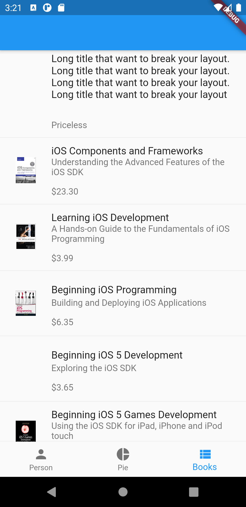
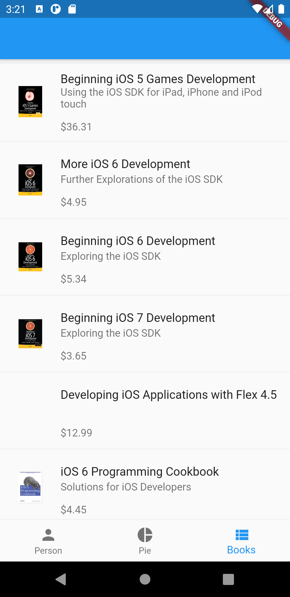
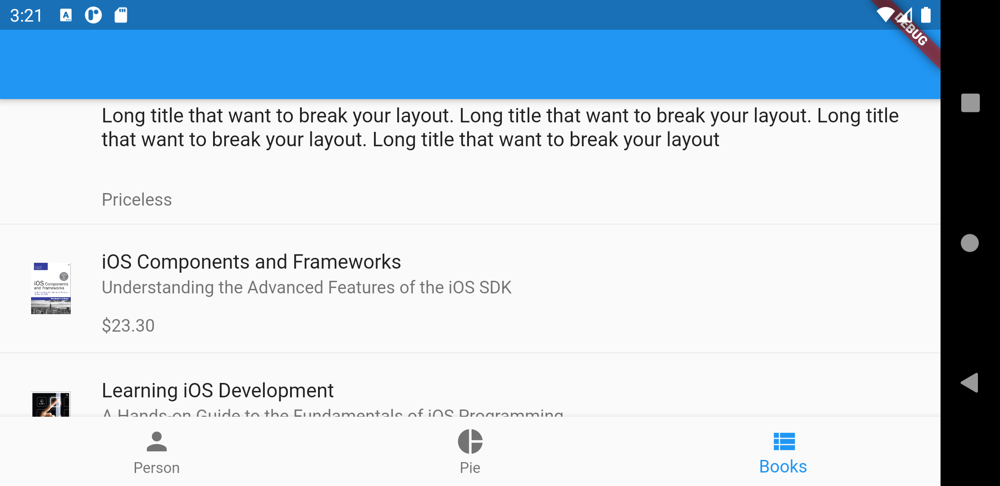
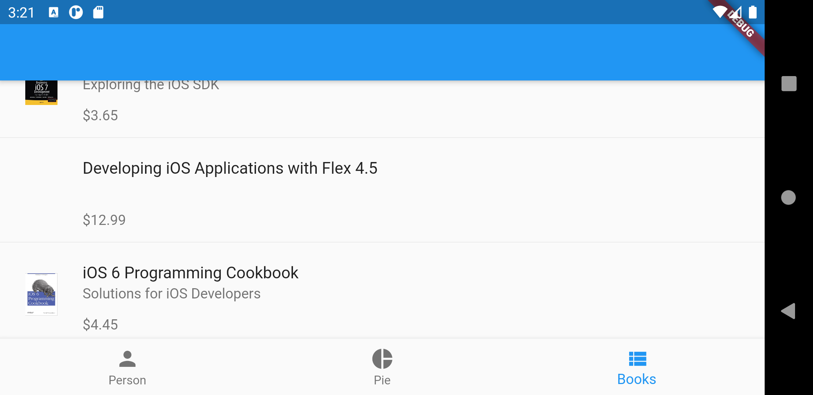

# Lab 3

Виконав: <br/>
Студент групи: ІО-81 <br/>
ЗК: ІО-8125 <br/>
Смірнов Назар <br/>

## Варіант №2

1. Візьміть за основу проект із лабораторної роботи 2.
2. Додайте третю вкладку у контейнерний вигляд UITabBarController. Вкажіть будь-яку назву та зображення за бажанням, які відрізняються від стандартних, для вкладки.
3. Предметну область визначте за варіантом, де варіант = (номер залікової книжки mod 2) + 1, завантажте відповідний архів з файлами, додайте файли до проекту: файл MoviesList.txt або BooksList.txt, які містять в собі дані у форматі JSON, та файли з зображеннями.
   | Варіант 1 | Варіант 2 |
   |-----------|-----------|
   |Предметна область – фільми | Предметна область – книги |

4. Створіть власний підклас (наприклад, ListViewController) класу UIViewController для контролера вигляду, що представлений третьою вкладкою. Створений клас буде відповідати за координацію відображення вмісту свого кореневого вигляду.
5. Створіть клас, який представляє модельну сутність визначеної предметної області (наприклад, Movie або Book). Додайте відповідні поля та ініціалізатори до класу (перегляньте вихідні дані з текстового файлу).
   У контролері вигляду, створеному на кроці 4, додайте метод, який при створенні екрану, завантажує дані з текстового файлу, розбирає їх та створює із них масив сутностей із кроку 5.
6. Додайте таблицю (UITableView) на екран. Кожен рядок таблиці буде представляти одну сутність із створеного масиву. Додайте до рядка таблиці вигляди (UIImageView, UILabel) для відображення даних про сутність.
   Заповніть таблицю даними сутностей з масиву (UITableViewDataSource).
   Переконайтеся, що можете запустити проект, та що все працює коректно.
   Закомітьте та відправте ваш проект до будь-якої системи контролю версій.
7. Підготуйте протокол за шаблоном.
8. Надішліть виконане завдання через Google Classroom - додайте посилання до вашого проекту та протокол.

## Скріншот роботи додатка

Приклад портретного відображення списку книг
<br/>

<br/>


Приклад альбомного відображення списку книг
<br/>

<br/>


## Лістинг коду

Приведенні лише ті файли які змінились, або номі з лабораторної роботи 2

```dart {.line-numbers}
// lib/home.dart

import 'package:flutter/material.dart';

import 'custom_painting.dart';
import 'person.dart';
import 'bookList.dart';

class HomePage extends StatefulWidget {
  @override
  State<StatefulWidget> createState() {
    return _HomePageState();
  }
}

class _HomePageState extends State<HomePage> {
  int _currentIndex = 0;

  final List<Widget> _children = [
    Person(),
    DrawingCanvas(),
    BookList(),
  ];

  @override
  Widget build(BuildContext context) {
    return Scaffold(
      body: _children[_currentIndex],
      bottomNavigationBar: BottomNavigationBar(
        onTap: onTabTapped,
        currentIndex: _currentIndex,
        items: const <BottomNavigationBarItem>[
          BottomNavigationBarItem(
            icon: Icon(Icons.person),
            label: "Person",
          ),
          BottomNavigationBarItem(
            icon: Icon(Icons.pie_chart),
            label: "Pie",
          ),
          BottomNavigationBarItem(
            icon: Icon(Icons.view_list),
            label: "Books",
          ),
        ],
      ),
    );
  }

  void onTabTapped(int index) {
    setState(() {
      _currentIndex = index;
    });
  }
}
```

```dart {.line-numbers}
// models/api_models.dart

import 'package:flutter/material.dart';

@immutable
class Book {
  final String title;
  final String subtitle;
  final String isbn13;
  final String price;
  final String image;

  const Book({
    @required this.title,
    @required this.subtitle,
    @required this.isbn13,
    @required this.price,
    @required this.image,
  });

  Book.fromJson(dynamic json)
      : this(
          title: json['title'],
          subtitle: json['subtitle'],
          isbn13: json['isbn13'],
          price: json['price'],
          image: json['image'],
        );

  @override
  String toString() {
    return 'Book: {title: $title, subtitle: $subtitle, isbn13: $isbn13, price: $price, image: $image}';
  }
}
```

```dart {.line-numbers}
// services/book_service.dart

import 'package:flutter_application_1/models/api_models.dart';

abstract class BookService {
  Future<List<Book>> getBooks();
}
```

```dart {.line-numbers}
// services/local_book_service.dart

import 'dart:convert';

import 'package:flutter/services.dart';
import 'package:flutter_application_1/models/api_models.dart';

import 'book_service.dart';

class LocalBookService implements BookService {
  @override
  Future<List<Book>> getBooks() async {
    try {
      // Read the file.
      String data = await rootBundle.loadString('assets/BooksList.txt');
      dynamic jsonBooks = jsonDecode(data);
      List<Book> books = List();

      for (dynamic book in jsonBooks['books']) {
        books.add(Book.fromJson(book));
      }
      return books;
    } catch (e) {
      // If encountering an error, return [].
      return [];
    }
  }
}
```

```dart {.line-numbers}
// bookList.dart

import 'dart:convert';

import 'package:flutter/material.dart';
import 'package:flutter/services.dart';
import 'package:flutter_application_1/services/book_service.dart';
import 'package:flutter_application_1/services/local_book_service.dart';

import 'models/api_models.dart';

class BookList extends StatefulWidget {
  final BookService bookService = LocalBookService();

  BookList({Key key}) : super(key: key);

  @override
  _BookListState createState() => _BookListState();
}

class _BookListState extends State<BookList> {
  Future<Widget> _getImage(String path) async {
    if (path == null) {
      return SizedBox.shrink();
    }

    try {
      await rootBundle.load(path);
      return Image.asset(path);
    } catch (_) {
      return SizedBox.shrink();
    }
  }

  Future<Widget> buildItem(Book book) async {
    Widget image;
    if (book.image != "") {
      image = await _getImage('assets/Images/${book.image}');
    } else {
      image = await _getImage(null); // return default image
    }
    return ListTile(
      isThreeLine: true,
      title: Text(book.title),
      subtitle: Column(
        crossAxisAlignment: CrossAxisAlignment.start,
        children: [
          Text(book.subtitle),
          Padding(
            padding: const EdgeInsets.only(top: 15),
            child: Text(book.price),
          ),
        ],
      ),
      leading: Container(
        child: image,
        width: 50,
      ),
    );
  }

  @override
  Widget build(BuildContext context) {
    return Scaffold(
      appBar: AppBar(),
      body: FutureBuilder<List<Widget>>(
        future: Future(() async {
          List<Book> books = await widget.bookService.getBooks();
          List<Widget> bookWidgets = List();
          for (Book book in books) {
            bookWidgets.add(await buildItem(book));
          }
          return bookWidgets;
        }),
        builder: (BuildContext context, AsyncSnapshot<List<Widget>> snapshot) {
          if (!snapshot.hasData) {
            return Center(child: CircularProgressIndicator());
          }

          List<Widget> books = snapshot.data;
          return ListView.separated(
            itemCount: books.length,
            separatorBuilder: (BuildContext context, int index) => Divider(),
            itemBuilder: (BuildContext context, int index) {
              if (!snapshot.hasData) {
                return Center(child: CircularProgressIndicator());
              }
              return books[index];
            },
          );
        },
      ),
    );
  }
}
```

## Висновок

В даній лабораторній роботі було вивчино спосіб робити з файлами через dart, та з json обєктами. Було створено клас для відображення списку книг.
