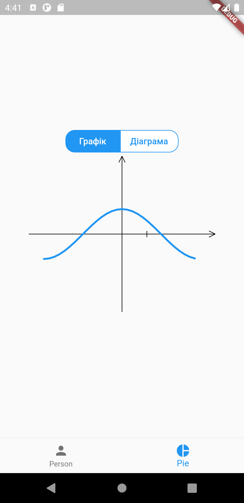
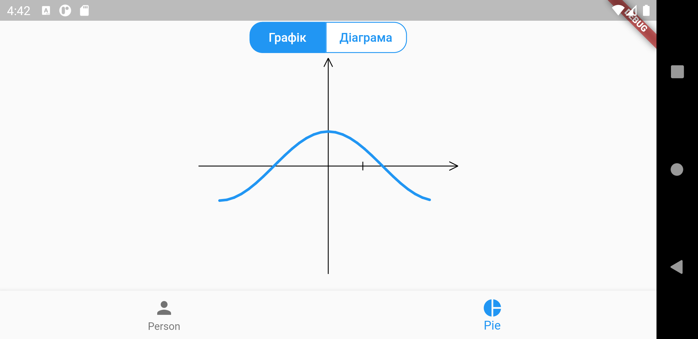
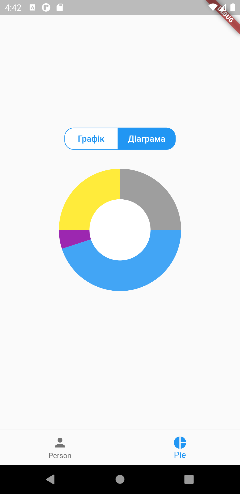
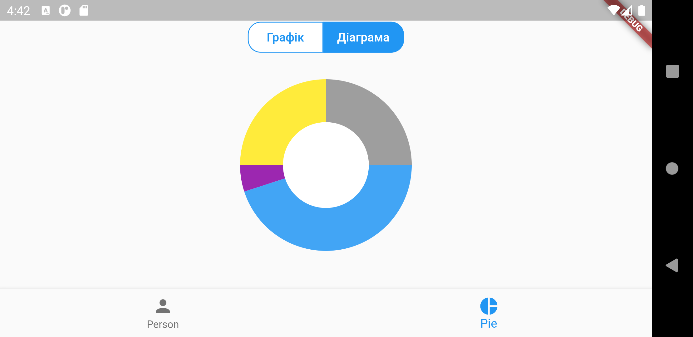

# Lab 2

Виконав: <br/>
Студент групи: ІО-81 <br/>
ЗК: ІО-8125 <br/>
Смірнов Назар <br/>

## Варіант №2

1. Візьміть за основу проект із лабораторної роботи 1.1.
2. Використайте другу існуючу вкладку у контейнерному вигляді UITabBarController. Вкажіть будь-яку назву та зображення за бажанням, які відрізняються від стандартних, для вкладки.
3. Створіть власний підклас (наприклад, DrawingViewController) класу UIViewController для контролера вигляду, що представлений другою вкладкою (по аналогії з першою вкладкою, де використовувався автоматично створений клас ViewController). Створений клас буде відповідати за координацію відображення вмісту свого кореневого вигляду.
4. У другій вкладці будуть відображатися вигляди, в яких реалізоване власне малювання. У виглядах буде відображатися (дивіться приклад виконання роботи в кінці документу): <br/>
   a) намальований по точкам графік функції; <br/>
   b) намальоване кільце кругової діаграми. <br/>
5. В один момент часу на екрані повинен відображатися один із двох малюнків, які описані у кроці 4. Додайте елемент керування для зміни того, що відображається в даний момент часу на екрані.
6. Створіть власний підклас класу UIView, перевизначте метод draw(\_:) для реалізації власного малювання. Призначте створений клас відповідному вигляду у Interface Builder.
7. Для малювання використовуйте клас UIBezierPath: <br/>
   a) для малювання графіку по точкам використовуйте методи: move(to:) та addLine(to:); <br/>
   b) для малювання кільця кругової діаграми використовуйте метод: addArc (withCenter:radius:startAngle:endAngle:clockwise:). <br/>
8. Параметри для малювання визначте за варіантом, де варіант = (номер залікової книжки mod 6) + 1. <br/>
   a) Функція y = cos(x) на проміжку x ∈ [-π; π]; <br/>
   b) Кільце кругової діаграми із секторами, що займають відповідний відсоток кола та мають відповідний колір: 45% (блакитний), 5% (фіолетовий), 25% <br/>
9. Переконайтеся, що можете запустити проект, та що все працює коректно.
10. Закомітьте та відправте ваш проект до будь-якої системи контролю версій.
11. Підготуйте протокол за шаблоном.
12. Надішліть виконане завдання через Google Classroom - додайте посилання до вашого проекту та протокол.

## Скріншот роботи додатка

Портрене зображення графіку:
<br/>


Альбомне зображення графіку:
<br/>


Портрене зображення діаграми:
<br/>


Альбомне зображення діаграми:
<br/>


## Лістинг коду

```dart {.line-numbers}
// main.dart

import 'package:flutter/material.dart';

import 'home_widget.dart';

void main() {
  runApp(MyApp());
}

class MyApp extends StatelessWidget {
  @override
  Widget build(BuildContext context) {
    return MaterialApp(
      home: HomePage(),
    );
  }
}

```

```dart {.line-numbers}
// home_widget.dart

import 'package:flutter/material.dart';
import 'package:flutter_application_1/custom_painting_widget.dart';
import 'package:flutter_application_1/person_widget.dart';

class HomePage extends StatefulWidget {
  @override
  State<StatefulWidget> createState() {
    return _HomePageState();
  }
}

class _HomePageState extends State<HomePage> {
  int _currentIndex = 0;

  final List<Widget> _children = [
    Person(),
    DrawingCanvas(), // заглушка
  ];

  @override
  Widget build(BuildContext context) {
    return Scaffold(
      body: _children[_currentIndex],
      bottomNavigationBar: BottomNavigationBar(
        onTap: onTabTapped,
        currentIndex: _currentIndex,
        items: const <BottomNavigationBarItem>[
          BottomNavigationBarItem(
            icon: Icon(Icons.person),
            label: "Person",
          ),
          BottomNavigationBarItem(
            icon: Icon(Icons.pie_chart),
            label: "Pie",
          ),
        ],
      ),
    );
  }

  void onTabTapped(int index) {
    setState(() {
      _currentIndex = index;
    });
  }
}
```

```dart {.line-numbers}
// person_widget.dart

import 'package:flutter/material.dart';

class Person extends StatelessWidget {
  @override
  Widget build(BuildContext context) {
    return Scaffold(
      body: Center(
        child: Column(
          mainAxisAlignment: MainAxisAlignment.center,
          children: <Widget>[
            Text(
              'Смірнов Назар'
              '\nГрупа ІО-81'
              '\nЗК ІО-8125',
              textAlign: TextAlign.center,
              style: TextStyle(fontSize: 28),
            ),
          ],
        ),
      ),
    );
  }
}
```

```dart {.line-numbers}
// toggleswitch_widget.dart

import 'package:flutter/material.dart';

class ToggleSwitch extends StatelessWidget {
  final List<String> children;
  final Function onChange;
  final int value;

  final Color activeColor;
  final Color defaultColor;

  ToggleSwitch({
    Key key,
    this.children,
    this.onChange,
    this.value,
    this.activeColor = Colors.blue,
    this.defaultColor = Colors.white,
  }) : super(key: key);

  @override
  Widget build(BuildContext context) {
    List<FlatButton> childrenList = List(children.length);

    for (int i = 0; i < childrenList.length; i++) {
      ShapeBorder shape;

      if (i == 0) {
        shape = RoundedRectangleBorder(
          borderRadius: BorderRadius.horizontal(left: Radius.circular(15)),
          side: BorderSide(
            color: activeColor,
          ),
        );
      } else if (i == children.length - 1) {
        shape = RoundedRectangleBorder(
          borderRadius: BorderRadius.horizontal(right: Radius.circular(15)),
          side: BorderSide(
            color: activeColor,
          ),
        );
      } else {
        shape = RoundedRectangleBorder(
          borderRadius: BorderRadius.zero,
          side: BorderSide(
            color: activeColor,
          ),
        );
      }

      childrenList[i] = FlatButton(
        onPressed: () {
          onChange(i);
        },
        child: Text(
          children[i],
          style: TextStyle(
            color: i == value ? defaultColor : activeColor,
          ),
        ),
        color: i == value ? activeColor : defaultColor,
        shape: shape,
      );
    }

    return Container(
      child: Row(
        mainAxisAlignment: MainAxisAlignment.center,
        crossAxisAlignment: CrossAxisAlignment.center,
        children: childrenList,
      ),
    );
  }
}
```

```dart {.line-numbers}
// custom_painting_widget.dart

import 'package:flutter/material.dart';
import 'dart:math';

import 'package:flutter_application_1/toggleswitch_widget.dart';

class DrawingCanvas extends StatefulWidget {
  DrawingCanvas({Key key}) : super(key: key);

  @override
  _DrawingCanvasState createState() => _DrawingCanvasState();
}

class _DrawingCanvasState extends State<DrawingCanvas> {
  final List<CustomPainter> painters = [
    CosPainter(),
    PiePainter([
      PiePart(0.45, Colors.blue[400]),
      PiePart(0.05, Colors.purple),
      PiePart(0.25, Colors.yellow),
      PiePart(0.25, Colors.grey),
    ])
  ];

  int _painterIndex = 0;

  @override
  Widget build(BuildContext context) {
    return Scaffold(
      body: Padding(
        padding: EdgeInsets.all(16.0),
        child: Center(
          child: Column(
            crossAxisAlignment: CrossAxisAlignment.center,
            mainAxisAlignment: MainAxisAlignment.center,
            children: [
              ToggleSwitch(
                value: _painterIndex,
                onChange: (int value) {
                  setState(() {
                    _painterIndex = value;
                  });
                },
                activeColor: Colors.blue,
                children: ["Графік", "Діаграма"],
              ),
              Center(
                child: CustomPaint(
                  painter: painters[_painterIndex],
                  child: Container(
                    width: 300,
                    height: 250,
                  ),
                ),
              ),
            ],
          ),
        ),
      ),
    );
  }
}

class PiePart {
  final double percent;
  final Color color;
  PiePart(this.percent, this.color);
}

class PiePainter extends CustomPainter {
  final List<PiePart> parts;
  final double diametr;
  PiePainter(this.parts, {this.diametr = 100});

  @override
  void paint(Canvas canvas, Size size) {
    final paint = Paint()
      ..color = Colors.black
      ..style = PaintingStyle.fill
      ..strokeWidth = 4;

    Offset center = Offset(size.width / 2, size.height / 2);
    final rect = Rect.fromLTRB(center.dx - diametr, center.dy - diametr,
        center.dx + diametr, center.dy + diametr);
    final useCenter = true;

    // ------- draw pie -------

    double startAngle = 0.0;
    for (PiePart p in parts) {
      paint.color = p.color;
      canvas.drawArc(rect, startAngle, p.percent * 2 * pi, useCenter, paint);
      startAngle += p.percent * 2 * pi;
    }

    // -------- draw white center ------
    paint.color = Colors.white;
    canvas.drawCircle(center, diametr / 2, paint);
  }

  @override
  bool shouldRepaint(covariant CustomPainter oldDelegate) {
    return false;
  }
}

class CosPainter extends CustomPainter {
  final Function f = cos;
  final double rangeStart = -pi;
  final double rangeEnd = pi;

  @override
  void paint(Canvas canvas, Size size) {
    int pointCount = 30;
    int scale = 40;

    var paint = Paint()
      ..color = Colors.black
      ..strokeWidth = 1
      ..style = PaintingStyle.stroke
      ..strokeCap = StrokeCap.butt;

    Offset center = Offset(size.width / 2, size.height / 2);

    // ----------- draw axises ------------
    canvas.drawLine(
        Offset(center.dx, size.height), Offset(center.dx, 0), paint);
    // draw arrow
    canvas.drawLine(Offset(center.dx, 0), Offset(center.dx - 5, 10), paint);
    canvas.drawLine(Offset(center.dx, 0), Offset(center.dx + 5, 10), paint);

    canvas.drawLine(Offset(0, center.dy), Offset(size.width, center.dy), paint);
    // draw arrow
    canvas.drawLine(Offset(size.width, center.dy),
        Offset(size.width - 10, center.dy - 5), paint);
    canvas.drawLine(Offset(size.width, center.dy),
        Offset(size.width - 10, center.dy + 5), paint);

    // ---------- line segment -----------
    Offset segment = Offset(center.dx + scale, center.dy);
    canvas.drawLine(Offset(segment.dx, segment.dy - 5),
        Offset(segment.dx, segment.dy + 5), paint);

    // ------------ calc function ------------
    paint = Paint()
      ..color = Colors.blue
      ..strokeWidth = 3
      ..style = PaintingStyle.stroke
      ..strokeCap = StrokeCap.round;

    List<Point<double>> points = List();
    // calc cos(x) : x in [rangeStart, rangeEnd)
    // with step: (rangeEnd - rangeStart) / pointCount

    for (int i = 0; i < pointCount; i++) {
      var x = (rangeEnd - rangeStart) * i / pointCount + rangeStart;
      var y = f(x);
      points.add(Point(x, y));
    }

    // ----------- draw function ------------
    Point pointer = points[0];

    for (Point p in points) {
      Offset p1 =
          Offset(center.dx + pointer.x * scale, center.dy - pointer.y * scale);
      Offset p2 = Offset(center.dx + p.x * scale, center.dy - p.y * scale);

      canvas.drawLine(p1, p2, paint);
      pointer = p;
    }
  }

  @override
  bool shouldRepaint(CustomPainter oldDelegate) {
    return false;
  }
}
```

## Висновок

В даній лабораторній роботі було створино власний екземпляр класу CustomPainter для малювання різних фігур, графіків та діаграм. Було створино власний ToggleSwitch для перемикання між різними зображеннями.
