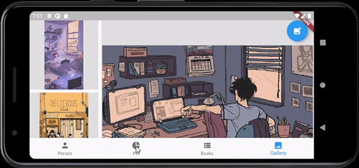

# Lab 6

Виконав: <br/>
Студент групи: ІО-81 <br/>
ЗК: ІО-8125 <br/>
Смірнов Назар <br/>

## Варіант №2

1. Візьміть за основу проект із лабораторної роботи 4.
2. Додайте четверту вкладку у контейнерний вигляд UITabBarController. Вкажіть будь-яку назву та зображення за бажанням, які відрізняються від стандартних, для вкладки. На екрані четвертої вкладки буде відображатися колекція картинок.
3. Додайте вигляд колекції (UICollectionView) на екран. Кожна комірка колекції (UICollectionViewCell) буде відображати зображення (UIImage). Додайте до комірки колекції вигляд для відображення зображення (UIImageView). Ширина колекції повинна дорівнювати ширині екрану, вміст колекції прокручується вертикально.
4. Забезпечте можливість відображати у колекції зображення, які користувач буде обирати із системної галереї зображень за допомогою контролера вигляду, що надає системний інтерфейс (UIImagePickerController). Додайте кнопку (або будь-який інший елемент керування), при натисканні на яку, відкривається контролер вигляду, що представляє системну галерею зображень. Після того як користувач обирає зображення, контролер вигляду, що представляє системну галерею зображень, закривається, і зображення додається та відображається у колекції.
5. Сітку для розташування та відносних розмірів комірок колекції оберіть за варіантом, де варіант = (номер залікової книжки mod 6) + 1. Зображена частина сітки, що повторюється, цифрою показаний відносний розмір кожної комірки. (Приклад – сітка з рекомендаціями на вкладці пошуку в додатку Instagram).
6. Переконайтеся, що можете запустити проект, та що все працює коректно.
7. Закомітьте та відправте ваш проект до будь-якої системи контролю версій.
8. Підготуйте протокол за шаблоном.
9. Надішліть виконане завдання через Google Classroom - додайте посилання до вашого проекту та протокол.

## приклад роботи додатка

Приклад роботи в портретному режимі
(відео в .mp4 лижить в readme_images)

<br/>
Приклад роботи в портретному режимі
(відео в .mp4 лижить в readme_images)


## Лістинг коду

```dart {.line-numbers}
// main.dart

import 'package:flutter/material.dart';

import 'pages/home_page.dart';

void main() {
  runApp(MyApp());
}

class MyApp extends StatelessWidget {
  @override
  Widget build(BuildContext context) {
    return MaterialApp(
      home: HomePage(),
    );
  }
}
```

```dart {.line_numbers}
// models/api_models.dart

import 'package:flutter/material.dart';

@immutable
class Book {
  final String title;
  final String subtitle;
  final String isbn13;
  final String price;
  final Image image;

  final String authors;
  final String publisher;
  final String pages;
  final String year;
  final String rating;
  final String desc;

  const Book({
    @required this.title,
    @required this.subtitle,
    @required this.price,
    this.isbn13,
    this.image,
    this.publisher,
    this.pages,
    this.year,
    this.rating,
    this.desc,
    this.authors,
  });

  Book.fromJson(dynamic json)
      : this(
          title: json['title'],
          subtitle: json['subtitle'],
          isbn13: json['isbn13'],
          price: json['price'],
          image: json['image'],
          publisher: json['publisher'],
          pages: json['pages'],
          year: json['year'],
          rating: json['rating'],
          desc: json['desc'],
          authors: json['authors'],
        );

  @override
  String toString() {
    return 'Book: {title: $title, subtitle: $subtitle, isbn13: $isbn13, price: $price, image: $image}';
  }
}
```

```dart {.line-numbers}
// pages/home_page.dart

import 'package:flutter/material.dart';
import 'package:flutter_application_1/widgets/gallery.dart';

import '../widgets/custom_painting.dart';
import '../widgets/person.dart';
import '../widgets/book_list.dart';

class HomePage extends StatefulWidget {
  @override
  State<StatefulWidget> createState() {
    return _HomePageState();
  }
}

class _HomePageState extends State<HomePage> {
  int _currentIndex = 0;

  final List<Widget> _children = [
    Person(),
    DrawingCanvas(),
    BookList(),
    Gallery(),
  ];

  @override
  Widget build(BuildContext context) {
    return Scaffold(
      body: _children[_currentIndex],
      bottomNavigationBar: BottomNavigationBar(
        onTap: onTabTapped,
        type: BottomNavigationBarType.fixed,
        currentIndex: _currentIndex,
        items: const <BottomNavigationBarItem>[
          BottomNavigationBarItem(
            icon: Icon(Icons.person),
            label: "Person",
          ),
          BottomNavigationBarItem(
            icon: Icon(Icons.pie_chart),
            label: "Pie",
          ),
          BottomNavigationBarItem(
            icon: Icon(Icons.view_list),
            label: "Books",
          ),
          BottomNavigationBarItem(
            icon: Icon(Icons.image),
            label: "Gallery",
          ),
        ],
      ),
    );
  }

  void onTabTapped(int index) {
    setState(() {
      _currentIndex = index;
    });
  }
}
```

```dart {.line-numbers}
// pages/book_add.dart

import 'package:flutter/material.dart';
import 'package:flutter_application_1/models/api_models.dart';

class BookAdd extends StatelessWidget {
  final _formKey = GlobalKey<FormState>();
  TextEditingController titleEditingController = TextEditingController();
  TextEditingController subtitleEditingController = TextEditingController();
  TextEditingController priceEditingController = TextEditingController();

  final Function onValid;

  BookAdd({Key key, @required this.onValid}) : super(key: key);

  @override
  Widget build(BuildContext context) {
    return Scaffold(
      appBar: AppBar(),
      body: SingleChildScrollView(
        child: Padding(
          padding: const EdgeInsets.only(left: 30.0, right: 30.0),
          child: Form(
            key: _formKey,
            child: Column(
              children: [
                TextFormField(
                  controller: titleEditingController,
                  decoration: InputDecoration(
                    labelText: "Title",
                  ),
                ),
                TextFormField(
                  controller: subtitleEditingController,
                  decoration: InputDecoration(
                    labelText: "Subtitle",
                  ),
                ),
                TextFormField(
                  controller: priceEditingController,
                  decoration: InputDecoration(
                    labelText: "Price",
                  ),
                  validator: (String value) {
                    if (double.tryParse(value) != null) {
                      return null;
                    }
                    return 'Please enter float number.';
                  },
                ),
                Padding(
                  padding: const EdgeInsets.symmetric(vertical: 5.0),
                  child: ElevatedButton(
                    onPressed: () {
                      if (_formKey.currentState.validate()) {
                        onValid(
                          Book(
                            title: titleEditingController.text,
                            subtitle: subtitleEditingController.text,
                            price: '\$${priceEditingController.text}',
                          ),
                        );
                        Navigator.of(context).pop();
                      }
                    },
                    child: Text('Add'),
                  ),
                )
              ],
            ),
          ),
        ),
      ),
    );
  }
}
```

```dart {.line-numbers}
// pages/book_details.dart

import 'dart:ui';

import 'package:flutter/material.dart';

class BookPage extends StatelessWidget {
  final double fontSize = 18;

  final String price;
  final String title;
  final String subtitle;
  final String isbn13;
  final Image image;
  final String publisher;
  final String pages;
  final String year;
  final String rating;
  final String desc;
  final String authors;

  const BookPage({
    Key key,
    @required this.title,
    @required this.subtitle,
    @required this.price,
    this.isbn13 = "",
    this.image,
    this.publisher = "",
    this.pages = "",
    this.year = "",
    this.rating = "",
    this.desc = "",
    this.authors = "",
  }) : super(key: key);

  @override
  Widget build(BuildContext context) {
    Widget content;

    content = view();

    return Scaffold(
      appBar: AppBar(),
      body: SingleChildScrollView(
        child: Center(
          child: content,
        ),
      ),
    );
  }

  Widget view() {
    return Column(
      children: [
        Hero(
          tag: "book-$title",
          child: image != null ? image : Container(),
        ),
        Container(
          width: window.physicalSize.width,
          child: Padding(
            padding: const EdgeInsets.all(15.0),
            child: Column(
              crossAxisAlignment: CrossAxisAlignment.start,
              children: [
                RichText(
                  textAlign: TextAlign.left,
                  softWrap: true,
                  text: TextSpan(
                    children: [
                      TextSpan(
                        text: 'Title: ',
                        style: TextStyle(
                          color: Colors.blue,
                          fontSize: fontSize,
                        ),
                      ),
                      TextSpan(
                        text: title,
                        style: TextStyle(
                          color: Colors.black,
                          fontSize: fontSize,
                        ),
                      ),
                    ],
                  ),
                ),
                RichText(
                  textAlign: TextAlign.left,
                  softWrap: true,
                  text: TextSpan(
                    children: [
                      TextSpan(
                        text: 'Subtitle: ',
                        style: TextStyle(
                          color: Colors.blue,
                          fontSize: fontSize,
                        ),
                      ),
                      TextSpan(
                        text: subtitle,
                        style: TextStyle(
                          color: Colors.black,
                          fontSize: fontSize,
                        ),
                      ),
                    ],
                  ),
                ),
                RichText(
                  textAlign: TextAlign.left,
                  softWrap: true,
                  text: TextSpan(
                    children: [
                      TextSpan(
                        text: 'Description: ',
                        style: TextStyle(
                          color: Colors.blue,
                          fontSize: fontSize,
                        ),
                      ),
                      TextSpan(
                        text: desc,
                        style: TextStyle(
                          color: Colors.black,
                          fontSize: fontSize,
                        ),
                      ),
                    ],
                  ),
                ),
                Container(
                  height: 30,
                ),
                RichText(
                  textAlign: TextAlign.left,
                  softWrap: true,
                  text: TextSpan(
                    children: [
                      TextSpan(
                        text: 'Authors: ',
                        style: TextStyle(
                          color: Colors.blue,
                          fontSize: fontSize,
                        ),
                      ),
                      TextSpan(
                        text: authors,
                        style: TextStyle(
                          color: Colors.black,
                          fontSize: fontSize,
                        ),
                      ),
                    ],
                  ),
                ),
                RichText(
                  textAlign: TextAlign.left,
                  softWrap: true,
                  text: TextSpan(
                    children: [
                      TextSpan(
                        text: 'Publisher: ',
                        style: TextStyle(
                          color: Colors.blue,
                          fontSize: fontSize,
                        ),
                      ),
                      TextSpan(
                        text: publisher,
                        style: TextStyle(
                          color: Colors.black,
                          fontSize: fontSize,
                        ),
                      ),
                    ],
                  ),
                ),
                Container(
                  height: 30,
                ),
                RichText(
                  textAlign: TextAlign.left,
                  softWrap: true,
                  text: TextSpan(
                    children: [
                      TextSpan(
                        text: 'Pages: ',
                        style: TextStyle(
                          color: Colors.blue,
                          fontSize: fontSize,
                        ),
                      ),
                      TextSpan(
                        text: pages,
                        style: TextStyle(
                          color: Colors.black,
                          fontSize: fontSize,
                        ),
                      ),
                    ],
                  ),
                ),
                RichText(
                  textAlign: TextAlign.left,
                  softWrap: true,
                  text: TextSpan(
                    children: [
                      TextSpan(
                        text: 'Year: ',
                        style: TextStyle(
                          color: Colors.blue,
                          fontSize: fontSize,
                        ),
                      ),
                      TextSpan(
                        text: year,
                        style: TextStyle(
                          color: Colors.black,
                          fontSize: fontSize,
                        ),
                      ),
                    ],
                  ),
                ),
                RichText(
                  textAlign: TextAlign.left,
                  softWrap: true,
                  text: TextSpan(
                    children: [
                      TextSpan(
                        text: 'Rating: ',
                        style: TextStyle(
                          color: Colors.blue,
                          fontSize: fontSize,
                        ),
                      ),
                      TextSpan(
                        text: rating,
                        style: TextStyle(
                          color: Colors.black,
                          fontSize: fontSize,
                        ),
                      ),
                    ],
                  ),
                ),
              ],
            ),
          ),
        )
      ],
    );
  }
}
```

```dart {.line-numbers}
// widgets/book_list.dart

import 'package:flutter/material.dart';

import 'package:flutter_slidable/flutter_slidable.dart';

import '../pages/book_add.dart';
import '../pages/book_details.dart';
import '../services/book_service.dart';
import '../services/local_book_service.dart';
import '../models/api_models.dart';

class BookList extends StatefulWidget {
  final BookService bookService = LocalBookService();

  BookList({Key key}) : super(key: key);

  @override
  _BookListState createState() => _BookListState();
}

class _BookListState extends State<BookList> {
  List<Book> books = List();
  List<Widget> bookWidgets = List();
  List<Widget> showWidgets = List();
  String searchLine = "";

  @override
  void initState() {
    super.initState();
    widget.bookService.getBooks().then((List<Book> books) async {
      List<Widget> bookWidgets = List();
      for (Book book in books) {
        bookWidgets.add(await _buildItem(book));
      }
      setState(() {
        this.books = books;
        this.bookWidgets = bookWidgets;
        this.showWidgets = bookWidgets.toList();
      });
    });
  }

  @override
  Widget build(BuildContext context) {
    if (books.isEmpty) {
      return Center(
        child: CircularProgressIndicator(),
      );
    }

    return Scaffold(
      appBar: AppBar(
        title: Padding(
          padding: const EdgeInsets.only(left: 10.0, right: 10.0),
          child: TextField(
            cursorColor: Colors.white,
            style: TextStyle(color: Colors.white),
            decoration: InputDecoration(
              border: InputBorder.none,
              focusedBorder: InputBorder.none,
              enabledBorder: InputBorder.none,
              errorBorder: InputBorder.none,
              disabledBorder: InputBorder.none,
              contentPadding:
                  EdgeInsets.only(left: 15, bottom: 11, top: 11, right: 15),
              labelText: "Search",
              labelStyle: TextStyle(color: Colors.white),
            ),
            onChanged: (value) {
              setState(() {
                searchLine = value;
                showWidgets = bookWidgets
                    .where((w) =>
                        books[bookWidgets.indexOf(w)].title.contains(value))
                    .toList();
              });
            },
          ),
        ),
        actions: [
          Padding(
            padding: EdgeInsets.only(right: 20.0),
            child: GestureDetector(
              onTap: () {
                Navigator.of(context).push(_bookAddPageRoute());
              },
              child: Icon(Icons.add),
            ),
          )
        ],
      ),
      body: Column(
        children: [
          Flexible(
            child: showWidgets.length != 0
                ? AnimatedContainer(
                    duration: Duration(seconds: 1),
                    child: ListView.builder(
                      itemCount: showWidgets.length,
                      itemBuilder: (context, index) => showWidgets[index],
                    ),
                  )
                : Center(
                    child: Text("No items found"),
                  ),
          ),
        ],
      ),
    );
  }

  Future<Widget> _buildItem(Book book) async {
    Image image = _getBookImage(book);
    return Slidable(
      key: Key(book.title),
      actionPane: SlidableScrollActionPane(),
      child: Container(
        color: Colors.white,
        child: ListTile(
          isThreeLine: true,
          title: Text(book.title),
          subtitle: Column(
            crossAxisAlignment: CrossAxisAlignment.start,
            children: [
              Text(book.subtitle),
              Padding(
                padding: const EdgeInsets.only(top: 15),
                child: Text(book.price),
              ),
            ],
          ),
          leading: Container(
            child: image != null ? image : SizedBox.shrink(),
            width: 50,
          ),
          onTap: () async {
            Book bookMore = await widget.bookService.getBook(book.isbn13);
            if (bookMore != null) {
              Navigator.of(context).push(_bookDetailsRoute(bookMore));
            } else {
              Scaffold.of(context).showSnackBar(SnackBar(
                  duration: const Duration(seconds: 1),
                  content: Text("Not found resurce")));
            }
          },
        ),
      ),
      secondaryActions: [
        IconSlideAction(
          caption: 'Delete',
          color: Colors.red,
          icon: Icons.delete,
          onTap: () {
            _removeBook(book);
          },
        ),
      ],
    );
  }

  void _removeBook(book) {
    var index = books.indexOf(book);

    setState(() {
      if (showWidgets.contains(bookWidgets[index])) {
        showWidgets.removeAt(showWidgets.indexOf(bookWidgets[index]));
      }
      books.removeAt(index);
      bookWidgets.removeAt(index);
    });
  }

  void _addBook(Book book) async {
    Widget w = await _buildItem(book);

    setState(() {
      books.add(book);
      bookWidgets.add(w);
      if (book.title.contains(searchLine)) {
        showWidgets.add(w);
      }
    });
  }

  Image _getBookImage(Book book) {
    if (widget.bookService is LocalBookService) {
      if (book.image == "") {
        return null;
      } else {
        return Image.asset('assets/Images/${book.image}');
      }
    } else {
      return null;
    }
  }

  Route _bookDetailsRoute(Book book) {
    return PageRouteBuilder(
      pageBuilder: (context, animation, secondaryAnimation) => BookPage(
        image: _getBookImage(book),
        title: book.title,
        subtitle: book.subtitle,
        price: book.price,
        authors: book.authors,
        desc: book.desc,
        isbn13: book.isbn13,
        pages: book.pages,
        publisher: book.publisher,
        rating: book.rating,
        year: book.year,
      ),
      transitionsBuilder: (context, animation, secondaryAnimation, child) {
        var begin = Offset(1.0, 0.0);
        var end = Offset.zero;
        var curve = Curves.ease;

        var tween =
            Tween(begin: begin, end: end).chain(CurveTween(curve: curve));

        return SlideTransition(
          position: animation.drive(tween),
          child: child,
        );
      },
    );
  }

  Route _bookAddPageRoute() {
    return PageRouteBuilder(
      pageBuilder: (context, animation, secondaryAnimation) {
        return BookAdd(
          onValid: (book) => _addBook(book),
        );
      },
      transitionsBuilder: (context, animation, secondaryAnimation, child) {
        var begin = Offset(1.0, 0.0);
        var end = Offset.zero;
        var curve = Curves.ease;

        var tween =
            Tween(begin: begin, end: end).chain(CurveTween(curve: curve));

        return SlideTransition(
          position: animation.drive(tween),
          child: child,
        );
      },
    );
  }
}
```

```dart {.line-numbers}
// widgets/gallery.dart

import 'dart:io';

import 'package:flutter/material.dart';
import 'package:flutter_staggered_grid_view/flutter_staggered_grid_view.dart';

import 'package:image_picker/image_picker.dart';

class Gallery extends StatefulWidget {
  Gallery({Key key}) : super(key: key);

  @override
  _GalleryState createState() => _GalleryState();
}

class _GalleryState extends State<Gallery> {
  @override
  Widget build(BuildContext context) {
    return MyImagePicker(
      build: (context, images) => StaggeredGridView.countBuilder(
        crossAxisCount: 4,
        itemCount: images.length,
        itemBuilder: (BuildContext context, int index) {
          return Container(
            child: images[index],
            color: Colors.grey[300],
          );
        },
        staggeredTileBuilder: (int index) => StaggeredTile.count(
            (index % 8 == 1) ? 3 : 1, (index % 8 == 1) ? 3 : 1),
        mainAxisSpacing: 8.0,
        crossAxisSpacing: 8.0,
      ),
    );
  }
}

class MyImagePicker extends StatefulWidget {
  final Function(BuildContext context, List<Image> images) build;
  MyImagePicker({Key key, this.build}) : super(key: key);

  @override
  _MyImagePickerState createState() => _MyImagePickerState();
}

class _MyImagePickerState extends State<MyImagePicker> {
  List<Image> images = List();
  selectImage() async {
    File image = await ImagePicker.pickImage(source: ImageSource.gallery);
    if (image != null) {
      setState(() {
        images.add(Image.file(image));
      });
    }
  }

  @override
  Widget build(BuildContext context) {
    return Scaffold(
      floatingActionButtonLocation: FloatingActionButtonLocation.endTop,
      floatingActionButton: FloatingActionButton(
          onPressed: () async {
            await selectImage();
          },
          child: Icon(Icons.add_photo_alternate)),
      body: widget.build(context, images),
    );
  }
}
```

```dart {.line-numbers}
// services/book_service.dart

import 'package:flutter_application_1/models/api_models.dart';

abstract class BookService {
  Future<List<Book>> getBooks();

  Future<Book> getBook(String isbn13);
}
```

```dart {.line-numbers}
// services/local_book_service.dart
import 'dart:convert';

import 'package:flutter/services.dart';
import 'package:flutter_application_1/models/api_models.dart';

import 'book_service.dart';

class LocalBookService implements BookService {
  @override
  Future<List<Book>> getBooks() async {
    try {
      // Read the file.
      String data = await rootBundle.loadString('assets/BooksList.txt');
      dynamic jsonBooks = jsonDecode(data);
      List<Book> books = List();

      for (dynamic book in jsonBooks['books']) {
        books.add(Book.fromJson(book));
      }
      return books;
    } catch (e) {
      // If encountering an error, return [].
      return [];
    }
  }

  @override
  Future<Book> getBook(String isbn13) async {
    try {
      // Read the file.
      String data = await rootBundle.loadString('assets/id/$isbn13.txt');

      dynamic jsonBook = jsonDecode(data);
      Book book = Book.fromJson(jsonBook);
      return book;
    } catch (e) {
      // If encountering an error, return null.
      return null;
    }
  }
}
```

## Висновок

Вданій лабораторній роботі було використано StaggeredGridView з бібліотеки flutter_staggered_grid_view для розміщення картинок по завданню. Також для вибору картинок було використано бібліотеку image_picker.
